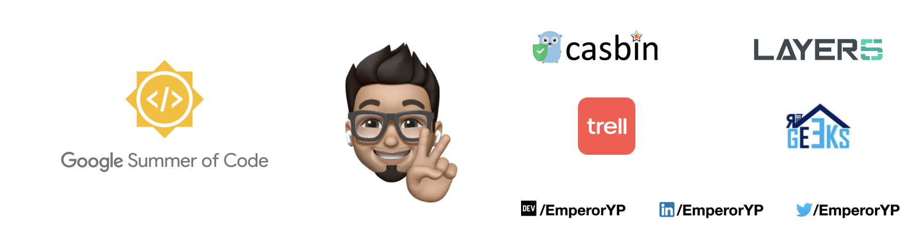

<h1 align="center">Hi 👋, I'm Yash Pandey</h1>
<h3 align="center">A passionate Software Development Engineer</h3>

  

  

  

- 🔭 I’m currently working on [Mobile Premiere League (MPL)](https://mpl.live)

- 🌱 I’m currently learning **Competitive Programming, GraphQL, Postgres, Container Orchestration and everything that my mind can grasp! :P**

- 👯 I’m looking to collaborate on [CoviSource](https://github.com/EmperorYP7/CoviSource)

- 👨‍💻 All of my projects are available at [emperoryp.live](https://emperoryp.live)

- 📝 I regularly write articles on [blog.emperoryp.live](http://blog.emperoryp.live)

- 💬 Ask me about **React, Express, C++17, GoLang**

- 📫 How to reach me **yash.btech.cs19@iiitranchi.ac.in**

- 📄 Know about my experiences [My Resume](https://drive.google.com/file/d/1mKy2q4mX8WawTQJKQvgiLyBV2LxZ8ODZ/view?usp=sharing)

- ⚡ Fun fact **I am a pianist and a [YouTuber](https://youtube.com/c/YashPandey_the_emperor). Hope you’d like my videos! 😉**

### Blogs posts
<!-- BLOG-POST-LIST:START -->
- [Web Development Roadmap for beginners](https://dev.to/emperoryp7/web-development-roadmap-for-beginners-3p53)
<!-- BLOG-POST-LIST:END -->

<h3 align="left">Connect with me:</h3>

<h3 align="left">Languages and Tools:</h3>

                                    

<h3 align="left">Support:</h3>

